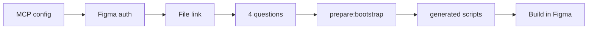

# Figma Design System Agent Access Wizard

Create a structured **design system in Figma** - pages, color/type/spacing tokens, documentation, component templates, and **14 semantic-token primitives** with **Light/Dark** previews - using scripts that an AI assistant runs through the [Figma MCP server](https://developers.figma.com/docs/figma-mcp-server/).

You answer **four setup questions** (name, scope, colors, font). The tool writes customized scripts to `generated/` and your assistant runs them in **your** Figma file.

---

## Table of contents

- [Who this is for](#who-this-is-for)
- [What you get in Figma](#what-you-get-in-figma)
- [Detailed output reference](#detailed-output-reference)
- [How setup works](#how-setup-works)
- [Choose your path](#choose-your-path)
- [The four setup questions](#the-four-setup-questions)
- [Setup scope options](#setup-scope-options)
- [After setup: check Figma](#after-setup-check-figma)
- [For developers](#for-developers)
- [Project structure](#project-structure)
- [Contributing & license](#contributing--license)

---

## Who this is for

| You are… | Start here |
|----------|------------|
| **Not technical** - you use Figma and Cursor/Chat, not the terminal | [Copy-paste prompt](prompts/start-here.md) |
| **Designer / PM** - guided setup in chat | [Copy-paste prompt](prompts/start-here.md) or [workflow guide](workflow/SETUP.md) |
| **Developer or AI agent** - MCP and scripts | [Agent checklist](prompts/setup-wizard.md) + [AGENTS.md](AGENTS.md) |
| **Terminal comfortable** | `npm run setup` then `npm run prepare:bootstrap` |

---

## What you get in Figma

Nothing changes in Figma until setup finishes and scripts run via MCP.

| Layer | What is created |
|--------|------------------|
| **Global tokens** | `Colors` (Light/Dark), `Spacing`, `Radius`, `Typography`, `Sizing` |
| **Component semantics** | `Component Colors` (94 roles, Light/Dark) + `Component/{Primitive}/…` aliases in dimension collections ([COMPONENT-TOKENS.md](docs/COMPONENT-TOKENS.md)) |
| **Structure** | Up to ~60 pages: Cover, Getting Started, Foundations, Primitives, Compound, Patterns, Layouts, Themes, Agent Reference |
| **Foundation docs** | Color, typography, spacing, radius, elevation frames |
| **Scaffolding** | `Component Page` placeholders + Agent Reference templates (script **14**) |
| **Primitives (full scope)** | All **14** components bound **only** to component semantic tokens, with Light/Dark previews on each primitive page and on **Themes** (script **17**) |

Scripts are **idempotent**: existing collections, frames, or components are skipped.

### Detailed output reference

Full inventory (variables, pages, script **17** behavior, limits):

**[docs/WHAT-THE-WORKFLOW-PRODUCES.md](docs/WHAT-THE-WORKFLOW-PRODUCES.md)**

Component build rules:

**[docs/COMPONENT-BUILD.md](docs/COMPONENT-BUILD.md)**

---

## How setup works

```text
1. Figma MCP in your editor (remote: https://mcp.figma.com/mcp)
2. Sign in to Figma (MCP authentication)
3. Paste your Figma Design file link (file key stays local)
4. Answer four setup questions → design-system.config.json
5. npm run prepare:bootstrap → generated/run-plan.json
6. Run each generated script in order via use_figma (agent or plugin)
```



**Important:** For scripts **15**-**17**, always use files under **`generated/`** after `prepare:bootstrap`. They embed your wizard choices and token registries.

**Privacy:** File links and file keys stay in chat or gitignored `local.config.json`. Never commit them.

---

## Choose your path

### Path A - Easiest (no terminal)

1. Open this repo in **Cursor** (or another editor with Figma MCP).
2. Open **[prompts/start-here.md](prompts/start-here.md)** and copy the prompt into a **new chat**.
3. Sign in to Figma when asked, paste your **Design** file link, answer the four questions.
4. Let the assistant run `prepare:bootstrap` and every script in `generated/run-plan.json`.
5. Open Figma when the assistant confirms completion.

Alternate: **[prompts/copy-paste-setup.txt](prompts/copy-paste-setup.txt)**

### Path B - Developer / agent

1. MCP: [examples/mcp.json.example](examples/mcp.json.example) → reload IDE.
2. **`mcp_auth`** (and `whoami` if needed).
3. File link → extract **fileKey** (session / `local.config.json` only).
4. **[prompts/setup-wizard.md](prompts/setup-wizard.md)** - four questions, then:

```bash
npm run prepare:bootstrap
```

5. For each entry in **`generated/run-plan.json`**, call **`use_figma`** with the matching `generated/*.js` file (skill: `figma-use`).
6. Verify per [docs/WORKFLOW.md](docs/WORKFLOW.md) and [AGENTS.md](AGENTS.md).

### Path C - Terminal wizard

```bash
npm run setup              # file link + four questions
npm run prepare:bootstrap  # writes generated/
```

MCP auth still happens in the IDE. Your agent runs the generated scripts.

### Optional checks (developers)

```bash
npm run verify:manifest
npm run verify:component-colors
npm run count:component-tokens
```

---

## The four setup questions

Asked **after** Figma MCP works and you shared a file link.

| # | Question | Field |
|---|----------|--------|
| **1** | Design system name? | `designSystemName` |
| **2** | Tokens only or full package? | `setupScope` |
| **3** | Primary and accent palette? | `primaryPalette`, `accentPalette` (Blue, Green, Red, Amber, Violet) |
| **4** | Main UI font? | `fontFamily` (install in Figma before doc scripts) |

Saved to `design-system.config.json` (gitignored). Schema: [config/design-system.config.example.json](config/design-system.config.example.json).

---

## Setup scope options

Profiles are defined in [scripts/manifest.json](scripts/manifest.json). **`generated/run-plan.json`** is the exact script list for your scope.

| You choose | `setupScope` | Scripts (ids) | MCP runs |
|------------|--------------|---------------|----------|
| **Variables only** | `variables-only` | `02`–`06`, `15`, `16` | **8** |
| **Full package** | `documentation-and-examples` | `01`–`14`, `15`, `16`, `17` | **17** |

**Variables only** - global + component semantic variables (no pages, no Figma components).

**Full package** - pages, foundation docs, placeholders, **all 14 primitives** (semantic tokens + Light/Dark previews).

### Execution order (full package)

Matches `manifest.json` `executionOrder` (not numeric sort):

`01` → `02`–`06` → `15`–`16` → `07`–`11` → `12`–`13` → `14` → `17`

---

## After setup: check Figma

**Variables only**

- **Local variables:** `Colors`, `Spacing`, `Radius`, `Typography`, `Sizing`, **`Component Colors`**
- Dimension collections include **`Component/Button/…`** style aliases (and other primitives)

**Full package**

- Everything above, plus pages and foundation frames
- Each **Primitives / …** page: `Component Page` scaffold + **`Built Component - {Name}`** with Light/Dark previews
- **Themes** page: **Primitive samples** under Light and Dark sections
- Primitives use **only** `Component Colors` and `Component/{Primitive}/…` bindings (no raw hex on component layers)

If something is missing, continue from **`generated/run-plan.json`** or re-run a single generated script (skipped steps stay skipped).

---

## For developers

### Prerequisites

- Figma **edit** access to the target file
- [Figma MCP](https://developers.figma.com/docs/figma-mcp-server/remote-server-installation/)
- Wizard **font installed** in Figma (default: Inter)

### MCP configuration

```json
{
  "mcpServers": {
    "figma": {
      "type": "http",
      "url": "https://mcp.figma.com/mcp"
    }
  }
}
```

### Script pipeline

| Phase | Scripts | Purpose |
|--------|---------|---------|
| Structure | `01` | Pages |
| Tokens | `02`–`06` | Global variable collections |
| Component tokens | `15`–`16` | `Component Colors` + `Component/*` aliases |
| Foundations | `07`–`11` | Foundations page visuals |
| Docs | `12`–`13` | Cover + Getting Started |
| Scaffolding | `14` | Component page templates, Themes, Agent Reference |
| Components | `17` | All primitives from [config/component-build.json](config/component-build.json) |

Shared build logic: [scripts/shared/](scripts/shared/). Conventions: [scripts/README.md](scripts/README.md).

### NPM scripts

| Command | Purpose |
|---------|---------|
| `npm run setup` | Interactive wizard → `design-system.config.json` |
| `npm run prepare:bootstrap` | Write `generated/*.js` + `run-plan.json` |
| `npm run verify:manifest` | Manifest, profiles, and files in sync |
| `npm run verify:component-colors` | Component Colors registry count (94) |
| `npm run count:component-tokens` | Component semantic token totals (241) |

### Running without MCP

Scripts are [Figma Plugin API](https://www.figma.com/plugin-docs/) JavaScript. Remote MCP: avoid `loadAllPagesAsync`, `setPluginData`, `createImageAsync`.

### Design principles

- **Component semantics** - primitives bind only to **15**/**16** outputs ([COMPONENT-BUILD.md](docs/COMPONENT-BUILD.md))
- **One set, two themes** - Light/Dark via variable modes, not duplicate components
- **Stable naming** - PascalCase components; `Variant=`, `Size=`, `State=` for future variants
- **AI-readable** - Agent Reference documents usage

### Roadmap

- Richer variant grids (v1 archetypes in script **17** today)
- CI validation for registries and manifest
- Optional community starter file

---

## Project structure

```text
Figma-design-system-agent-access-wizard/
├── prompts/                    ← start-here, setup-wizard, copy-paste
├── workflow/SETUP.md
├── config/
│   ├── design-system.config.schema.json
│   ├── component-color-roles.json
│   ├── component-build.json    ← 14 primitives + archetypes for script 17
│   └── component-tokens/         ← dimension role registry
├── scripts/
│   ├── manifest.json           ← order, phases, profiles
│   ├── shared/                 ← bindings + archetypes (inlined into generated 17)
│   └── *.js                    ← source templates (__DS_CONFIG__ = null)
├── generated/                  ← gitignored; run these in Figma
├── docs/
│   ├── WHAT-THE-WORKFLOW-PRODUCES.md
│   ├── WORKFLOW.md
│   ├── COMPONENT-BUILD.md
│   └── COMPONENT-TOKENS.md
├── tools/
│   ├── wizard.mjs
│   ├── prepare-bootstrap.mjs
│   └── verify-manifest.mjs
├── examples/mcp.json.example
├── AGENTS.md
├── CONTRIBUTING.md
└── LICENSE
```

---

## Contributing & license

See [CONTRIBUTING.md](CONTRIBUTING.md). [MIT](LICENSE)
