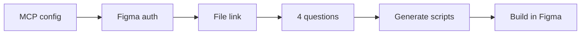

# Figma Design System Agent Access Wizard

Create a structured **design system in Figma**-pages, color/type/spacing tokens, documentation, and component templates-using scripts that an AI assistant runs for you through the [Figma MCP server](https://developers.figma.com/docs/figma-mcp-server/).

You customize four choices (name, scope, colors, font). The tool generates the right scripts and applies them to **your** Figma file.

---

## Table of contents

- [Who this is for](#who-this-is-for)
- [What you get in Figma](#what-you-get-in-figma)
- [Detailed output reference](#detailed-output-reference)
- [How setup works](#how-setup-works)
- [Choose your path](#choose-your-path)
- [The four setup questions](#the-four-setup-questions)
- [Setup scope options](#setup-scope-options)
- [After setup: check Figma](#after-setup-check-figma)
- [For developers](#for-developers)
- [Project structure](#project-structure)
- [Contributing & license](#contributing--license)

---

## Who this is for

| You are… | Start here |
|----------|------------|
| **Not technical** - you use Figma and Cursor/Chat, not the terminal | [Copy-paste prompt](prompts/start-here.md) |
| **Designer / PM** - you want guided setup in chat | [Copy-paste prompt](prompts/start-here.md) or [workflow guide](workflow/SETUP.md) |
| **Developer or AI agent** - you run MCP and scripts | [Agent checklist](prompts/setup-wizard.md) + [AGENTS.md](AGENTS.md) |
| **Terminal comfortable** | `npm run setup` then `npm run prepare:bootstrap` |

---

## What you get in Figma

This repository does **not** change your Figma file by itself. Content appears in Figma only **after** you complete setup and the assistant (or you) runs the generated scripts.

| Layer | What is created |
|--------|------------------|
| **Tokens (variables)** | Colors (Light/Dark), Spacing, Radius, Typography, Sizing |
| **Structure** | Up to ~60 pages: Cover, Getting Started, Foundations, Primitives, Compound, Patterns, Layouts, Themes, Agent Reference |
| **Foundation docs** | Visual pages for color, typography, spacing, radius, elevation |
| **Scaffolding** | Placeholder frames on each component page + Agent Reference templates |

Scripts are **safe to run again**: if something already exists (e.g. Colors collection), that step is skipped.

### Detailed output reference

For a **full inventory** of variables, pages, frames, and placeholders (including what is *not* created), see:

**[docs/WHAT-THE-WORKFLOW-PRODUCES.md](docs/WHAT-THE-WORKFLOW-PRODUCES.md)**

---

## How setup works

Every run follows the **same order**:

```text
1. Figma MCP configured in your editor
2. Sign in to Figma (MCP authentication)
3. You paste your Figma Design file link
4. You answer four setup questions
5. Tool generates customized scripts → runs them in your file
```



**Privacy:** Your Figma file link and file key stay in your chat or local gitignored files (`local.config.json`). They are **not** committed to this repository.

---

## Choose your path

### Path A - Easiest (recommended if you avoid the terminal)

1. Open this folder in **Cursor** (or another editor with Figma MCP).
2. Open **[prompts/start-here.md](prompts/start-here.md)**.
3. Copy the prompt into a **new chat** and send it.
4. Follow the assistant: sign in to Figma when asked, paste your file link, answer four questions.
5. Open Figma when the assistant says it is done.

Plain-text prompt only: **[prompts/copy-paste-setup.txt](prompts/copy-paste-setup.txt)**

### Path B - Developer / agent (step-by-step checklist)

1. Add Figma MCP - copy [examples/mcp.json.example](examples/mcp.json.example) into your editor MCP settings and reload.
2. Authenticate - agent calls `mcp_auth`; complete browser sign-in if prompted.
3. File link - paste your Figma Design URL when asked.
4. Follow **[prompts/setup-wizard.md](prompts/setup-wizard.md)** for the four questions and script execution.
5. Details: [docs/WORKFLOW.md](docs/WORKFLOW.md) · [AGENTS.md](AGENTS.md)

### Path C - Terminal wizard (optional)

MCP auth still happens in the IDE. The CLI collects your **file link** and **four answers**, then prepares scripts:

```bash
npm run setup
npm run prepare:bootstrap
```

Then run each script listed in `generated/run-plan.json` via Figma MCP `use_figma` (usually your agent does this).

---

## The four setup questions

The assistant asks these **after** Figma is connected and you have shared your file link.

| # | Question (plain language) | What it controls |
|---|---------------------------|------------------|
| **1** | What is your design system called? | Cover title, Getting Started text |
| **2** | Tokens only, or full docs and examples too? | See [setup scope](#setup-scope-options) |
| **3** | Primary and accent color? | Brand palettes: Blue, Green, Red, Amber, Violet |
| **4** | Main UI font? | Inter, Roboto, Plus Jakarta Sans, IBM Plex Sans, Source Sans 3 |

Answers are saved locally in `design-system.config.json` (gitignored). Technical schema: [config/design-system.config.example.json](config/design-system.config.example.json).

---

## Setup scope options

| You choose | `setupScope` value | What runs in Figma |
|------------|-------------------|---------------------|
| **Variables only** | `variables-only` | Global tokens (02-06) plus component semantics (15-16); see [COMPONENT-TOKENS.md](docs/COMPONENT-TOKENS.md) |
| **Full package** | `documentation-and-examples` | Everything above **plus** all pages, foundation visuals, Cover, Getting Started, component page templates, Agent Reference (scripts 01-14) |

Use **variables only** for a token-only file. Use **full package** for the complete design system scaffold.

---

## After setup: check Figma

**Variables only**

- Open **Local variables** in Figma.
- You should see collections such as **Colors**, **Spacing**, **Radius**, **Typography**, **Sizing** (depending on scope).

**Full package**

- **Pages:** Cover, Getting Started, Foundations, Primitives / …, Agent Reference, etc.
- **Foundations page:** frames like Color System, Typography Scale.
- **Variables:** all five collections above.
- **Component pages:** a **Component Page** frame with section placeholders.

If something is missing, tell your assistant to continue from `generated/run-plan.json` or re-run setup (existing parts will skip).

---

## For developers

### Prerequisites

- Figma account with **edit** access to the target file
- [Figma MCP](https://developers.figma.com/docs/figma-mcp-server/remote-server-installation/) in the client
- Chosen **font installed** in Figma before doc scripts run (default: Inter)

### MCP configuration

```json
{
  "mcpServers": {
    "figma": {
      "type": "http",
      "url": "https://mcp.figma.com/mcp"
    }
  }
}
```

### Script pipeline

| Phase | Scripts | Purpose |
|--------|---------|---------|
| Structure | `01` | Create pages |
| Tokens | `02`-`06` | Variable collections |
| Foundations | `07`-`11` | Documentation on Foundations page |
| Docs | `12`-`13` | Cover + Getting Started |
| Scaffolding | `14` | Component templates + Agent Reference |

Order and dependencies: [scripts/manifest.json](scripts/manifest.json). Source templates live in [scripts/](scripts/); customized copies go to `generated/` after `npm run prepare:bootstrap`.

### Running without MCP

Scripts are plain [Figma Plugin API](https://www.figma.com/plugin-docs/) JavaScript. You can run them from a custom plugin. When using remote MCP, avoid: `loadAllPagesAsync`, `setPluginData`, `createImageAsync`.

### NPM scripts

| Command | Purpose |
|---------|---------|
| `npm run setup` | Interactive: file link + four questions |
| `npm run prepare:bootstrap` | Build `generated/` from `design-system.config.json` |
| `npm run verify:manifest` | Check script files match manifest |

### Design principles

- **Variables first** - prefer tokens over hardcoded values in components
- **Stable naming** - PascalCase components; `Variant=`, `Size=`, `State=` for variants
- **AI-readable** - Agent Reference describes when to use each component
- **Theme-ready** - semantic colors alias primitives with Light/Dark modes

### Roadmap

- Built primitive components (Button, Input, …) bound to variables
- Component-level semantic variable collection
- Validation in CI
- Optional community Figma starter file

---

## Project structure

```text
Figma-design-system-agent-access-wizard/
├── prompts/
│   ├── start-here.md           ← Non-technical: copy-paste chat prompt
│   ├── copy-paste-setup.txt
│   ├── setup-wizard.md         ← Agent/technical checklist
│   └── bootstrap.md
├── workflow/
│   └── SETUP.md                ← Human-readable setup flow
├── config/
│   ├── design-system.config.schema.json
│   └── design-system.config.example.json
├── scripts/
│   ├── manifest.json           ← Script order & profiles
│   └── 01-14 *.js              ← Bootstrap source templates
├── generated/                  ← Created by prepare:bootstrap (gitignored)
├── docs/
│   ├── WHAT-THE-WORKFLOW-PRODUCES.md  ← Full list of Figma output
│   └── WORKFLOW.md             ← MCP execution details
├── examples/
│   ├── mcp.json.example
│   └── local.config.example.json
├── tools/
│   ├── wizard.mjs
│   └── prepare-bootstrap.mjs
├── AGENTS.md
├── CONTRIBUTING.md
└── LICENSE
```

---

## Contributing & license

Contributions welcome - see [CONTRIBUTING.md](CONTRIBUTING.md).

[MIT](LICENSE)
