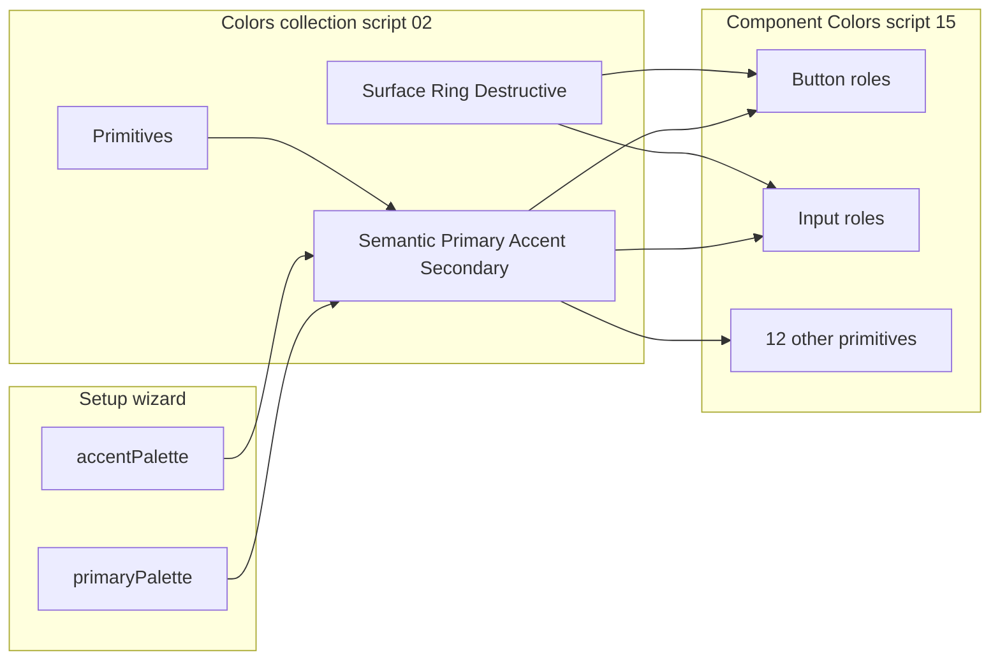

# Component color tokens

Per-primitive **color semantics** for all **14 primitives**, stored in the Figma collection **`Component Colors`** (Light/Dark). Values are **aliases** into the global **`Colors`** collection so wizard **primaryPalette** and **accentPalette** flow through `Semantic/*` without duplicating hex values.

Machine-readable registry: [`config/component-color-roles.json`](../config/component-color-roles.json)  
Bootstrap script: [`scripts/15-component-colors.js`](../scripts/15-component-colors.js) (after script `02`)

Non-color component semantics (spacing, type, radius, sizing): [`COMPONENT-TOKENS.md`](COMPONENT-TOKENS.md) and script `16`.

---

## Architecture



| Layer | Collection | Purpose |
|-------|------------|---------|
| Primitives | `Colors` | Hue scales (Blue, Violet, Neutral, ...) |
| Global semantic | `Colors` | `Semantic/Primary`, `Semantic/Accent`, `Semantic/Secondary`, status colors |
| Global surface | `Colors` | `Surface/Background`, `Surface/Border`, `Surface/Ring`, ... |
| **Component semantic** | **`Component Colors`** | `{Primitive}/{RolePath}` aliases to rows above |

**Why a separate collection?** Designers filter component-specific roles without mixing them with global primitives. Light/Dark modes stay aligned with `Colors`.

---

## Naming convention

```text
{PrimitiveName}/{RolePath}
```

- **PrimitiveName** - PascalCase, matches Figma page short name (`Button`, `Input`, not `Primitives / Button`).
- **RolePath** - slash-separated roles from the template (see below).

Examples:

- `Button/Action/Primary/Background`
- `Input/Field/Border`
- `Switch/Track/On`

---

## Role taxonomy

Templates group reusable role sets. Wizard palettes affect tokens **indirectly** via global semantics:

| Taxonomy | Maps from wizard / global | Typical use |
|----------|---------------------------|-------------|
| **action-primary** | `Semantic/Primary`, `Semantic/Primary Hover`, `Neutral/0` on-primary | Primary buttons, checked controls, switch on-track, spinner |
| **action-accent** | `Semantic/Accent` | Accent buttons, badge accent variant |
| **action-secondary** | `Semantic/Secondary` + `Surface/Foreground` | Secondary buttons |
| **field** | `Surface/Card`, `Surface/Border`, `Surface/Foreground`, muted placeholder | Inputs, textareas, selects |
| **focus** | `Surface/Ring` (primary-driven in script 02) | Focus ring on interactive controls |
| **destructive** | `Surface/Destructive` + foreground | Destructive button variant |
| **control** | Border, background, checked fill | Checkbox, radio |
| **toggle** | Track off/on, thumb | Switch |
| **display** | Foreground, muted background, accent pair | Label, badge, avatar, skeleton |
| **chrome** | Muted foreground, border-like background | Icon, separator |
| **feedback** | Primary foreground, muted track | Spinner |

### Template: `interactive` (14 roles per component)

Used by: **Button**, **Input**, **Textarea**, **Select**

| Role path | Aliases to (`Colors`) |
|-----------|------------------------|
| `Action/Primary/Background` | `Semantic/Primary` |
| `Action/Primary/Foreground` | `Neutral/0` |
| `Action/Primary/Hover` | `Semantic/Primary Hover` |
| `Action/Accent/Background` | `Semantic/Accent` |
| `Action/Accent/Foreground` | `Neutral/0` |
| `Action/Secondary/Background` | `Semantic/Secondary` |
| `Action/Secondary/Foreground` | `Surface/Foreground` |
| `Field/Background` | `Surface/Card` |
| `Field/Foreground` | `Surface/Foreground` |
| `Field/Border` | `Surface/Border` |
| `Field/Placeholder` | `Surface/Muted Foreground` |
| `Focus/Ring` | `Surface/Ring` |
| `Destructive/Background` | `Surface/Destructive` |
| `Destructive/Foreground` | `Surface/Destructive Foreground` |

**Button** uses action + destructive roles for variants. **Input / Textarea / Select** use field + focus roles (action roles remain available for affix buttons or future variants).

### Template: `choice` (5 roles)

Used by: **Checkbox**, **Radio**

| Role path | Aliases to |
|-----------|------------|
| `Control/Border` | `Surface/Border` |
| `Control/Background` | `Surface/Card` |
| `Control/Checked` | `Semantic/Primary` |
| `Control/CheckedForeground` | `Neutral/0` |
| `Focus/Ring` | `Surface/Ring` |

### Template: `toggle` (4 roles)

Used by: **Switch**

| Role path | Aliases to |
|-----------|------------|
| `Track/Off` | `Surface/Input` |
| `Track/On` | `Semantic/Primary` |
| `Thumb` | `Neutral/0` |
| `Focus/Ring` | `Surface/Ring` |

### Template: `display` (4 roles)

Used by: **Label**, **Badge**, **Avatar**, **Skeleton**

| Role path | Aliases to |
|-----------|------------|
| `Foreground` | `Surface/Foreground` |
| `Background` | `Surface/Muted` |
| `Accent/Background` | `Semantic/Accent` |
| `Accent/Foreground` | `Neutral/0` |

### Template: `chrome` (2 roles)

Used by: **Icon**, **Separator**

| Role path | Aliases to |
|-----------|------------|
| `Foreground` | `Surface/Muted Foreground` |
| `Background` | `Surface/Border` |

### Template: `feedback` (2 roles)

Used by: **Spinner**

| Role path | Aliases to |
|-----------|------------|
| `Foreground` | `Semantic/Primary` |
| `Track` | `Surface/Muted` |

---

## Primitive matrix (all 14)

| Primitive | Template | # color variables | Role paths (summary) |
|-----------|----------|-------------------|----------------------|
| Button | interactive | 14 | Full action, field, focus, destructive set |
| Input | interactive | 14 | Same template (field + focus for control chrome) |
| Textarea | interactive | 14 | Same as Input |
| Select | interactive | 14 | Same as Input |
| Checkbox | choice | 5 | Control + focus |
| Radio | choice | 5 | Control + focus |
| Switch | toggle | 4 | Track, thumb, focus |
| Label | display | 4 | Text + optional accent badge styling |
| Badge | display | 4 | Default + accent surfaces |
| Avatar | display | 4 | Fill + accent ring/badge |
| Icon | chrome | 2 | Glyph + optional plate |
| Separator | chrome | 2 | Line color + hit area |
| Skeleton | display | 4 | Shimmer block colors |
| Spinner | feedback | 2 | Arc + track |

**Total variables:** 94 (choice template adds `Label/Foreground` for Checkbox and Radio)

---

## Bootstrap and idempotency

1. Run **`02-variables-colors.js`** (creates `Colors` with wizard-driven semantics).
2. Run **`npm run prepare:bootstrap`** (embeds registry into generated `15-component-colors.js`).
3. Run **`15-component-colors.js`** via MCP `use_figma`.

If **`Component Colors`** already exists, script **15** skips the entire collection (no partial updates). To rebuild, delete the collection in Figma and re-run.

**Requires:** `Colors` collection present. **Safe for MCP:** no blocked Plugin APIs.

---

## Binding components (future)

When building Figma component sets:

| Part | Bind to |
|------|---------|
| Primary button fill | `Button/Action/Primary/Background` |
| Primary button label | `Button/Action/Primary/Foreground` |
| Input border | `Input/Field/Border` |
| Checkbox checked | `Checkbox/Control/Checked` |

Prefer **component** tokens over raw `Semantic/*` so each primitive page documents its contract.

---

## Related

- [WHAT-THE-WORKFLOW-PRODUCES.md](WHAT-THE-WORKFLOW-PRODUCES.md) - token totals
- [AGENTS.md](../AGENTS.md) - agent binding rules
- [COMPONENT-TOKENS.md](COMPONENT-TOKENS.md) - typography/spacing/radius/sizing aliases (script 16)
