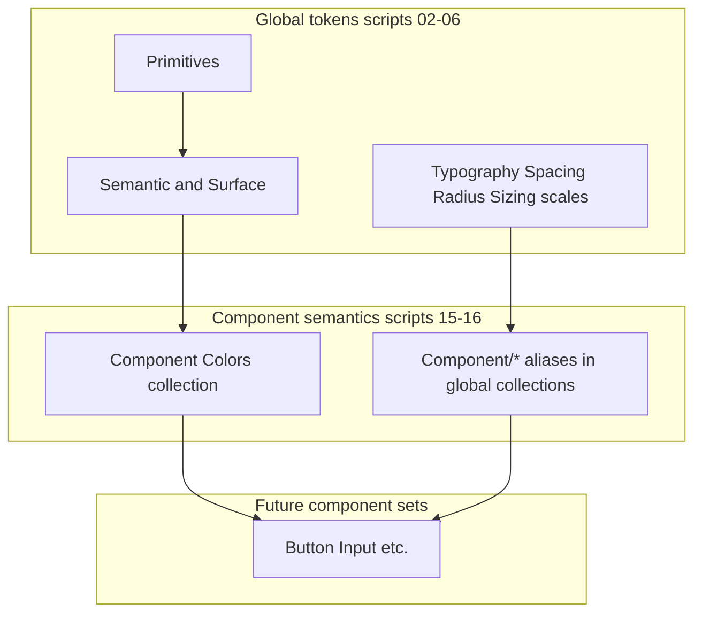

# Component semantic tokens

Component semantics sit **above** global primitives and **below** Figma components. They give each primitive a stable contract for colors, type, spacing, radius, and sizing so future `use_figma` component builds bind to one naming scheme.

## Layered model



| Layer | Where it lives | Modes | Driven by wizard |
|-------|----------------|-------|------------------|
| Primitives | `Colors` | Light, Dark | Palettes in file (all hues) |
| Global semantic | `Colors` (`Semantic/*`, `Surface/*`) | Light, Dark | `primaryPalette`, `accentPalette` via script 02 |
| **Component colors** | **`Component Colors`** | Light, Dark | Aliases to `Semantic/*` / `Surface/*` (inherits brand) |
| **Component dimensions** | **`Typography`, `Spacing`, `Radius`, `Sizing`** with `Component/{Name}/...` | Value | Aliases to global scale tokens; font from `fontFamily` in 05 |

Primary palette maps to **action** roles (`Action/Primary/*`). Accent palette maps to **accent** roles (`Action/Accent/*`) through global `Semantic/Accent` (script 02).

## Naming

### Component Colors (separate collection)

```text
{Component}/{RolePath}
```

Examples:

- `Button/Action/Primary/Background`
- `Input/Field/Border`
- `Switch/Track/On`

### Other dimensions (prefixed in existing collections)

```text
Component/{Component}/{RolePath}
```

Examples:

- `Component/Button/Label/Size` (Typography, aliases `Size/SM`)
- `Component/Input/Padding/X` (Spacing, aliases `Spacing/3`)
- `Component/Button/Corner` (Radius, aliases `Radius/MD`)
- `Component/Button/Height` (Sizing, aliases `Component Height/md`)

## Role taxonomy by dimension

### Colors (template keys in [component-color-roles.json](../config/component-color-roles.json))

| Template | Used by | Role groups |
|----------|---------|-------------|
| `interactive` | Button, Input, Textarea, Select | Action primary/accent/secondary, field, focus, destructive |
| `choice` | Checkbox, Radio | Control border/background/checked |
| `toggle` | Switch | Track on/off, thumb, focus ring |
| `display` | Label, Badge, Avatar, Skeleton | Foreground, background, accent |
| `chrome` | Icon, Separator | Foreground, background |
| `feedback` | Spinner | Foreground, track |

### Typography ([typography.json](../config/component-tokens/typography.json))

| Template | Typical roles |
|----------|----------------|
| `interactive` | Label size/weight/line-height, helper text |
| `display` | Label size/weight/line-height |
| `compact` | Smaller label (Badge) |

### Spacing ([spacing.json](../config/component-tokens/spacing.json))

| Template | Typical roles |
|----------|----------------|
| `control` | Padding X/Y, gap, icon gap |
| `field` | Padding, gap, helper margin |
| `inline` | Tight padding for checkbox/radio/label/badge |
| `minimal` | Separator thickness, icon inset |

### Radius ([radius.json](../config/component-tokens/radius.json))

| Template | Typical roles |
|----------|----------------|
| `rounded` | Default corner + focus ring radius |
| `pill` | Badge, Switch |
| `subtle` | Checkbox, Label, Icon, Separator |
| `circle` | Radio, Avatar, Spinner |

### Sizing ([sizing.json](../config/component-tokens/sizing.json))

| Template | Typical roles |
|----------|----------------|
| `control` | Height, min touch, icon size |
| `field` | Field height, touch, icon |
| `multiline` | Textarea min height |
| `compact` | Small controls |
| `avatar` | Avatar size |
| `icon` | Icon size |
| `line` | Separator hit area |
| `spinner` | Spinner size |

## Primitive matrix (summary)

| Primitive | Color template | Typography | Spacing | Radius | Sizing |
|-----------|----------------|------------|---------|--------|--------|
| Button | interactive | interactive | control | rounded | control |
| Input | interactive | interactive | field | rounded | field |
| Textarea | interactive | interactive | field | rounded | multiline |
| Select | interactive | interactive | field | rounded | field |
| Checkbox | choice | display | inline | subtle | compact |
| Radio | choice | display | inline | circle | compact |
| Switch | toggle | display | inline | pill | compact |
| Label | display | display | inline | subtle | compact |
| Badge | display | compact | inline | pill | compact |
| Avatar | display | display | inline | circle | avatar |
| Icon | chrome | display | minimal | subtle | icon |
| Separator | chrome | display | minimal | subtle | line |
| Skeleton | display | display | control | rounded | control |
| Spinner | feedback | display | minimal | circle | spinner |

Color registry: [component-color-roles.json](../config/component-color-roles.json) (see [COMPONENT-COLOR-TOKENS.md](COMPONENT-COLOR-TOKENS.md)).  
Other dimensions: [config/component-tokens/](../config/component-tokens/).

## Figma Plugin API pattern (cross-collection aliases)

Global variables must exist before scripts **15** and **16**.

```javascript
const target = figma.variables.getLocalVariables().find((v) => v.name === "Semantic/Primary");
const v = figma.variables.createVariable("Button/Action/Primary/Background", componentCollection, "COLOR");
v.setValueForMode(lightModeId, figma.variables.createVariableAlias(target));
```

Aliases reference the **variable**, not a mode id; Light/Dark on `Component Colors` each alias the corresponding global variable, which already holds per-mode values on `Colors`.

For FLOAT/STRING tokens in `Typography` / `Spacing` / etc., use the same `createVariableAlias` pattern into the single `Value` mode.

## Bootstrap order

| Script | Requires |
|--------|----------|
| `15-component-colors.js` | `02` (`Colors`) |
| `16-component-dimensions.js` | `03`, `04`, `05`, `06` |

Both run after global tokens in `variables-only` and full profiles. Registry JSON is embedded at `npm run prepare:bootstrap` into generated scripts.

## Token counts (default registry)

| Target | Variables (default registry) |
|--------|------------------------------|
| Component Colors | 92 |
| Typography `Component/*` | 50 |
| Spacing `Component/*` | 44 |
| Radius `Component/*` | 19 |
| Sizing `Component/*` | 34 |
| **Total component semantic** | **239** |

Counts depend on [config/component-tokens/](../config/component-tokens/); adjust JSON and re-run prepare.

## Open decisions

| Topic | Current choice | Alternative |
|-------|----------------|-------------|
| Non-color dimensions | `Component/*` prefix inside global collections | Separate `Component Spacing` collections |
| STRING typography | Not aliased per component (use global `Font/Sans` from wizard) | Add `Component/Button/Font` STRING aliases |
| Re-run script 15 | Skips entire collection if `Component Colors` exists | Migration script to add roles |
| Compound components | Not in v1 | Extend registry with Card, Dialog, etc. |

## Related docs

- [WHAT-THE-WORKFLOW-PRODUCES.md](WHAT-THE-WORKFLOW-PRODUCES.md)
- [AGENTS.md](../AGENTS.md) token bindings
